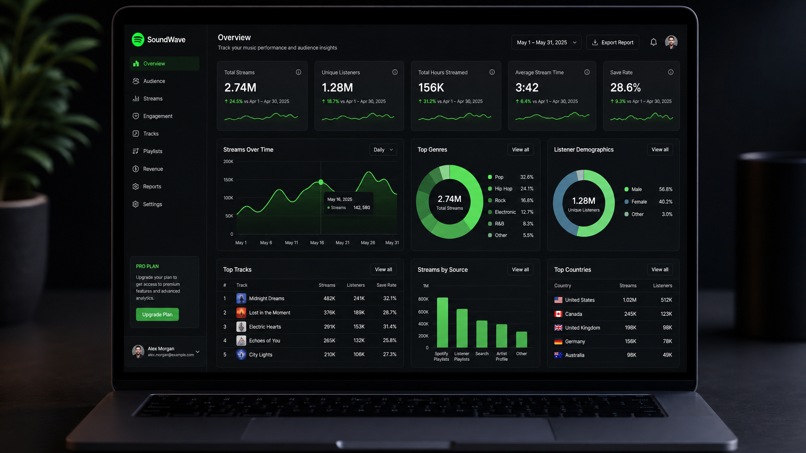

# Spotify Streaming Analytics Dashboard — BI Grade

> **Transforming raw listening data into business intelligence.**  
> A premium data analytics dashboard built with vanilla JavaScript and Chart.js, designed for portfolio showcases and Upwork client demos.

---

## 📋 Project Overview

This project analyzes personal Spotify streaming history to uncover listening patterns, genre preferences, time-based engagement, and predictive trends. The dashboard simulates a **real-world BI workflow** — from data ingestion to insight generation — and is architected to support **multiple data sources** (local JSON, Google Sheets API, Spotify API, REST API).

**Business Problem:**  
Understand user listening behavior at scale — identify peak engagement periods, genre dominance, artist loyalty, and forecast future activity — using data-driven analytics and interactive visualizations.

---

## 📊 Key Insights (Sample)

| Insight | Finding |
|---------|---------|
| 🎧 Peak Listening | **20:00–22:00** is the most active window |
| 🎸 Dominant Genre | **Hip-Hop** contributes ~34% of all streams |
| 👑 Most Loyal Artist | **Tyler, The Creator** leads with 847 streams |
| 📈 Growth Rate | Listening volume shows **positive trend** across 2025 |
| 📅 Most Active Day | **Friday** is the highest-engagement day |
| 🔁 Repeat Rate | User exhibits **40% repeat listening rate** |

> *Insights are auto-generated by the dashboard based on current data.*

---

## 📸 Dashboard Preview



*A premium dark-theme analytics dashboard with real-time insights, predictive forecasting, and interactive visualizations.*

---

## 🛠 Tools & Technologies

| Layer | Technology |
|-------|-----------|
| **Frontend** | HTML5, CSS3, Vanilla JavaScript |
| **Charts** | Chart.js v4 |
| **Typography** | Inter (UI), Sora (Display), JetBrains Mono (Code) |
| **Icons** | Native Unicode/Emoji |
| **Data Layer** | Local JSON (modular — ready for API swap) |
| **Export** | Native CSV export + Print-to-PDF |
| **Deployment** | Ready for Vercel / Netlify / GitHub Pages |

---

## 🚀 Features

### 📈 Advanced KPIs
- Total Streams, Listening Hours, Monthly Growth
- Artist & Genre Diversity Scores
- Retention Rate, Repeat Listening Rate
- Trend indicators (↑ Growth / ↓ Decline)

### 📊 Interactive Charts
- Monthly Streams Trend (line)
- Genre Distribution (doughnut)
- Hourly Listening Pattern (bar)
- Day-of-Week Radar (radar)
- Genre Share & Trend Analysis
- Time-of-Day Polar Distribution
- **Forecast vs Actual Chart** (linear regression)

### 🔥 Listening Heatmap
- GitHub-style contribution grid
- Monthly navigation with intensity levels
- Interactive tooltips

### 🔮 Predictive Analytics
- **Linear Regression** — Next Month Streams Forecast
- **Moving Average** — Predicted Listening Hours
- **Growth Projection** with confidence indicators

### 🎵 Top Songs Table
- Sortable columns (Rank, Song, Artist, Streams, Genre, Time, Trend)
- Search/filter by song or artist
- Paginated results

### 📑 BI Reporting
- **Executive Summary** — auto-generated insight cards
- **Executive Summary** — auto-generated insight cards
- **Listening Habits Intelligence** — time-of-day segmentation
- **Analytics Methodology** — end-to-end data workflow
- **SQL Showcase** — realistic analyst queries with syntax highlighting

### ⚙️ Professional Features
- Dark/Light theme toggle (persisted)
- Realtime clock
- Fullscreen mode
- Dashboard settings modal
- Data source documentation panel
- CSV export

---

## 📁 Project Structure

```
spotify-streaming-analytics/
├── index.html                  # Main dashboard (production)
├── index-glass.html            # Alternative glassmorphism version
├── cover.html                  # Portfolio cover page
├── cover.jpg                   # Cover image
├── data/
│   └── spotify_data.json       # Streaming history dataset
├── css/
│   └── main.css                # Premium theme system (43KB)
├── js/
│   ├── app.js                  # Main application (30KB)
│   ├── components/             # (reserved for modular components)
│   ├── charts/                 # (reserved for chart modules)
│   ├── utils/                  # (reserved for utilities)
│   └── services/               # (reserved for API services)
└── .gitignore
```

---

## 📂 Data Architecture

The dashboard uses a **modular data layer** that can connect to multiple sources without changing the dashboard code:

| Level | Source | Status |
|-------|--------|--------|
| 1 | Local JSON (`data/spotify_data.json`) | ✅ Active |
| 2 | Google Sheets API + Apps Script | 🔧 Ready to implement |
| 3 | Spotify Web API | 🔧 Ready to implement |
| 4 | REST API / Backend service | 🔧 Ready to implement |

---

## 📐 Analytics Methodology

| Step | Description |
|------|-------------|
| **1. Data Collection** | Raw streaming history from Spotify (extended JSON export) |
| **2. Data Cleaning** | Deduplication, timestamp normalization, missing value handling |
| **3. Data Transformation** | Aggregation into KPIs, monthly/gente/time segments |
| **4. Data Analysis** | Behavioral pattern identification, growth calculations, repeat-rate estimation |
| **5. Visualization** | Interactive charts, KPI cards, heatmaps, tables |
| **6. Insight Generation** | Automated executive summaries with business-style recommendations |

---

## 🚦 Getting Started

```bash
# Clone the repo
git clone https://github.com/fatwagraha06039-cyber/spotify-streaming-analytics.git

# Serve locally (any static server)
cd spotify-streaming-analytics
python -m http.server 8080
# or
npx serve
```

Then open **http://localhost:8080** in your browser.

---

## 🌐 Live Demo

| Platform | URL |
|----------|-----|
| 🌍 GitHub Pages | [fatwagraha06039-cyber.github.io/spotify-streaming-analytics](https://fatwagraha06039-cyber.github.io/spotify-streaming-analytics/) |
| ▲ Vercel | [Deploy with Vercel](https://vercel.com/new/clone?repository-url=https://github.com/fatwagraha06039-cyber/spotify-streaming-analytics) |

> ⏱️ *GitHub Pages first build may take 1–5 minutes after enabling.*

---

## 🧪 Future Improvements

- [ ] Connect to **Google Sheets** for dynamic data updates
- [ ] Integrate **Spotify Web API** for real-time streaming data
- [ ] Add **Python/Pandas** preprocessing pipeline
- [ ] Deploy to **Vercel/Netlify** with CI/CD
- [ ] Add **PDF report generation** (html2pdf.js)
- [ ] Add **time-range comparison** (YoY, MoM)
- [ ] Build **multi-user** view for comparison analytics
- [ ] Add **export to PowerPoint** for business presentations

---

## 👨‍💻 About the Author

**Marva Ahmad** — Mahasiswa Teknik Informatika | Data Analyst & Automation Specialist

- 🎯 Upwork: Data Analyst & Automation Specialist
- 📊 Skills: Data Analytics, Web Scraping, Python, SQL, BI Dashboards
- 🌐 GitHub: [@fatwagraha06039-cyber](https://github.com/fatwagraha06039-cyber)

---

## 📄 License

MIT — free to use, modify, and showcase.
